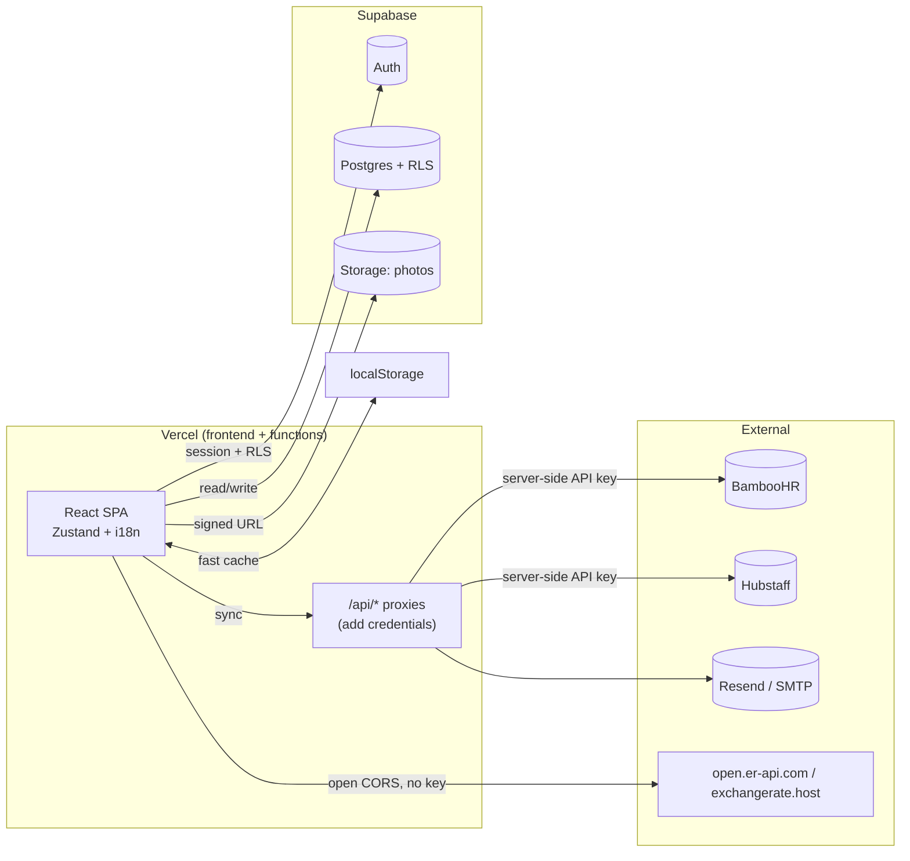

# Spectra Suite — System Documentation

> Reference document to understand **how the system is designed and how it works**. Written so
> that any technical reader (or a new developer) can understand the architecture, modules,
> data layer, security, and deployment.
>
> Related files in the repo: `CLAUDE.md` (project rules), `AGENTS.md` (agent working rules),
> `IMPORT_RULES.md` (module isolation), `supabase/migrations/` (database schema), `e2e/`
> (browser tests).
>
> 🇪🇸 **A condensed Spanish summary is at the end of this document (Section 13).**

---

## 1. What is Spectra Suite?

Spectra Suite is a **white-label payroll + HR + billing** system for companies with hourly
employees, focused on the **Dominican Republic** (TSS + ISR tax law) with multi-country
support. It is a **commercializable SaaS**: one app with several modules, a unified design,
multi-language (ES/EN), and light/dark mode.

It integrates data from:
- **BambooHR** — employee directory, HR data, photos, supervisors.
- **Hubstaff** — worked hours.

And persists everything to **Supabase (Postgres)** as the durable source of truth.

### Modules
| Module | Path | What it does |
|---|---|---|
| **Payroll** (Nómina) | `/nomina` | Runs payroll (TSS, ISR, hours, OT, holidays), history, reports. |
| **HR** (RRHH) | `/rrhh` | Directory, profiles, photos, documents, time off, **org chart**. |
| **Billing** (Facturación) | `/facturacion` | Bills clients for staff labor. **Everything in USD$.** |
| **Documents** | `/documentos` | Generates contracts/letters from HR data, per country. |
| **Boards** (Tablero) | `/tablero` | Trello-style kanban for managers. |
| **Expenses / IT** | `/gastos`, `/it` | Placeholders ("Coming Soon"). |
| **Employee portal** | `/suite`, `/me`, `/calendar` | Mini-home, self-service profile, calendar, rewards, news. |
| **Administration** | `/suite/settings`, `/suite/news`, `/suite/connectors` | Global config, news, connectors. |

---

## 2. Tech stack

- **Frontend:** Vite + React 18 + TypeScript + Tailwind CSS + shadcn/ui + lucide-react +
  recharts + TanStack Query + **Zustand** (state) + react-i18next (ES/EN).
- **Backend:** Serverless functions in `/api/` (Vercel format), TypeScript. They are
  **proxies** that add server-side credentials (CORS + security).
- **PDF:** `@react-pdf/renderer` (pay stubs, reports, documents, baseball cards).
- **Email:** Resend (primary), SMTP fallback.
- **Persistence:** Supabase (Postgres + Auth + Storage). localStorage as a fast cache.
- **Testing:** Vitest (unit) + **Playwright** (browser/e2e with screenshots).
- **Deploy:** Vercel (frontend + functions) + Supabase (DB/Auth/Storage).

---

## 3. Architecture

### 3.1 Modular structure
```
src/
├── modules/            # Each module is self-contained and isolated
│   ├── nomina/
│   ├── rrhh/
│   ├── facturacion/
│   ├── documentos/
│   └── tablero/
├── shared/             # Shared, module-agnostic layer
│   ├── components/     # Shared UI (shadcn/ui, layout, RateBadge, HelpCenter…)
│   ├── store/          # Shared Zustand stores (employees, payroll, settings, FX…)
│   ├── lib/            # Pure utilities (cloudSync, exchangeRate, storage, supabase…)
│   ├── hooks/          # Hooks (useCurrentEmployee…)
│   ├── context/        # AuthContext, ThemeContext
│   ├── help/           # User-manual content
│   └── types/          # Global types (incl. Supabase schema mapping)
├── suite/              # Suite "shell" (home, settings, news, calendar…)
└── App.tsx             # Composition root: mounts routes + providers
api/                    # Serverless functions (proxies)
supabase/migrations/    # SQL schema (run manually)
e2e/                    # Playwright tests + screenshots
```

### 3.2 Isolation rules (see `IMPORT_RULES.md`, enforced in CI)
1. **A module does NOT import from another module.** Only from `@/shared`. To share data
   between modules, use/create an accessor in `@/shared/lib`.
2. **`shared/**` does NOT import from a module or from `suite/**`.** The shared layer is
   feature-agnostic.
3. **`shared/lib/**` does NOT import from `shared/store/**`.** Base lib stays state-agnostic.
4. The composition root (`src/App.tsx`, `src/main.tsx`) **may** wire everything together.

Enforced by `npm run lint:imports` (madge for cycles + `scripts/check-imports.mjs`).

### 3.3 Data principle: *offline-first, cloud-authoritative*
- **localStorage** is the fast local layer (instant reads, offline).
- **Supabase** is the **durable source of truth**: data is read back on login (hydration). On
  conflict, **the cloud wins**; records that only exist locally are uploaded.
- Each shared store exposes a `hydrateFromCloud()` that runs on login (in `AuthContext`). If
  the cloud is unreachable, the local cache is kept.

---

## 4. How everything works (the big picture)

### 4.1 Data flow (high level)



**Key points:**
- **BambooHR/Hubstaff/Resend credentials never reach the browser**: they live in server-side
  `process.env` and are injected by the `/api/*` proxies.
- The **exchange rate (FX)** is fetched directly from the browser (free APIs with open CORS,
  no key).
- Every DB read/write goes through **RLS** (Row Level Security) based on the role.

### 4.2 Session lifecycle (hydration)
```
Login (Supabase Auth)
   └─ AuthContext detects the session
        ├─ loads profile + roles/permissions (RBAC)
        └─ hydrates stores from the cloud (best-effort, in parallel):
             company, connectors, payroll settings, fiscal params,
             employees (Payroll), employeeHr (HR/Documents), payroll history,
             baseball cards, country fiscal, module visibility, rewards flag,
             exchange rate, …
```
Result: entering **from any device** (including a phone), the system is populated **from the
database**, with no need to sync BambooHR first.

### 4.3 BambooHR sync pattern
```
An admin presses "Sync"
   → /api/bamboohr (proxy adds the API key)
   → BambooHR returns employees/photos/supervisors
   → mapped to CloudEmployee
   → saved to the `employees` table (Supabase) + local cache
   → photos are downloaded and saved to Storage (private bucket)
Sync brings new changes; day-to-day operation reads from the DB.
```

---

## 5. Data layer & persistence

### 5.1 Two persistence mechanisms
1. **Dedicated tables** (relational, with per-table RLS) — for clearly-shaped data:
   `employees`, `employee_payroll_settings`, `employee_baseball_cards`,
   `rrhh_employee_photos`, `payroll_runs`, billing/documents tables, `tablero_*`,
   `portal_news`, `portal_rewards`, `company_events`, etc.
2. **`app_state` (JSONB KV)** — for shared configuration blobs across all users (the
   "all config lives in the DB" pattern): fiscal parameters, payroll settings, email
   templates, module visibility, rewards switch, the daily exchange rate, etc.

> **Project golden rule:** *all* system configuration lives in the database and is persistent
> and shared across users (not only in localStorage).

### 5.2 Migrations (run MANUALLY in the Supabase SQL editor)
Migrations are **not auto-applied**. They are additive and idempotent; the owner pastes them
into the Supabase SQL editor. Summary:

| # | File | What it adds |
|---|---|---|
| 001 | initial_schema | profiles, permissions, company_settings, base |
| 002 | first_user_admin | first user = admin |
| 003 | fix_rls_recursion | RLS recursion fix |
| 004 | public_company_settings | public read of company settings |
| 005 | audit_log_and_session_timeout | audit log + session timeout |
| 006 | rbac_roles | roles, role permissions, assignments |
| 007 | audit_rpc | server-side audit RPC |
| 008 | employee_payroll_status | payroll-inclusion flag |
| 009 | billing_module | billing |
| 010 | cloud_persistence | `app_state` table (config KV) |
| 011 | documentos_module | documents |
| 012 | employees_table | `employees` table (durable directory) |
| 013 | employee_photo_source | durable photos (source + version) |
| 014 | employee_payroll_settings | per-employee tax exemption |
| 015 | employee_baseball_cards | editable baseball cards |
| 016 | tablero_boards | kanban board (boards/lists/cards) |
| 017 | employee_self_read | an employee can read THEIR OWN row (self-service) |
| 018 | portal_news_rewards | news + daily rewards + `is_manager()` helper |
| 019 | company_calendar | events + safe birthdays function |
| 020 | employee_supervisor_id | `supervisor_id` for the org chart from the DB |

### 5.3 Row Level Security (RLS)
Every sensitive table has `SECURITY DEFINER` functions (e.g. `is_super_admin()`,
`is_manager()`, `tablero_can_manage()`, `employees_can_read()`) that decide who reads/writes.
Examples:
- **employees:** read by admins/HR; a normal employee reads only **their own row** (by email).
- **portal_news / company_events:** everyone reads; only managers write.
- **portal_rewards:** each user reads/writes only their own row.
- **company_birthdays():** function exposing **only** name + birth month/day (no year, no
  sensitive data) to any authenticated user.

### 5.4 Data model (ER diagram)

The main tables and how they relate. Notes:
- **Solid relationships** are enforced foreign keys. **`(by employee id)`** relationships are
  *logical* links via a TEXT employee id (BambooHR id) — not DB-enforced foreign keys, since
  the employee directory is keyed by the external BambooHR id.
- `employees.supervisor_id` is a **self-reference** (employee → their supervisor) that drives
  the org chart.
- `payroll_runs.data` is a **JSONB** snapshot of the whole run (entries, totals, frozen FX
  rate); it is not normalized into rows.
- `app_state` is a **KV (JSONB)** table for shared config blobs (no relationships).
- `rrhh_employee_photos` is created manually in Supabase (not in a migration); it stores the
  Storage path + source/version per employee.

```mermaid
erDiagram
  AUTH_USERS ||--|| PROFILES : "is"
  PROFILES ||--o{ USER_ROLES : "assigned"
  ROLES ||--o{ USER_ROLES : "grants"
  ROLES ||--o{ ROLE_PERMISSIONS : "has"
  PROFILES ||--o{ USER_MODULE_PERMISSIONS : "legacy perms"
  PROFILES ||--o{ AUDIT_LOG : "acted"

  EMPLOYEES ||--o| EMPLOYEE_PAYROLL_SETTINGS : "tax exemption"
  EMPLOYEES ||--o| EMPLOYEE_BASEBALL_CARDS : "card"
  EMPLOYEES ||--o| RRHH_EMPLOYEE_PHOTOS : "photo"
  EMPLOYEES ||--o{ EMPLOYEES : "supervises (supervisor_id)"

  BILLING_CLIENTS ||--o{ BILLING_INVOICES : "billed"
  BILLING_CLIENTS ||--o{ BILLING_TITLE_RATES : "rates"
  BILLING_CLIENTS ||--o{ BILLING_CLIENT_EMPLOYEES : "assigns"
  EMPLOYEES ||--o{ BILLING_CLIENT_EMPLOYEES : "(by employee id)"

  TABLERO_BOARDS ||--o{ TABLERO_LISTS : "has"
  TABLERO_BOARDS ||--o{ TABLERO_CARDS : "has"
  TABLERO_LISTS ||--o{ TABLERO_CARDS : "contains"

  AUTH_USERS ||--o| PORTAL_REWARDS : "daily rewards"
  AUTH_USERS ||--o{ PORTAL_NEWS : "authored"
  AUTH_USERS ||--o{ COMPANY_EVENTS : "created"
  PROFILES ||--o{ VACATION_PAYMENTS : "approved"

  AUTH_USERS {
    uuid id PK
  }
  PROFILES {
    uuid id PK "= auth.users.id"
    text email
    text role "super_admin|module_admin|viewer|custom"
    bool is_active
  }
  ROLES {
    uuid id PK
    text name
  }
  ROLE_PERMISSIONS {
    uuid role_id FK
    text module
    bool can_view
    bool can_edit
    bool can_approve
    bool can_admin
  }
  USER_ROLES {
    uuid user_id FK
    uuid role_id FK
  }
  USER_MODULE_PERMISSIONS {
    uuid user_id FK
    text module
  }
  AUDIT_LOG {
    uuid id PK
    text action
    text category
  }

  EMPLOYEES {
    text bamboohr_id PK "external BambooHR id"
    text supervisor_id FK "self -> bamboohr_id"
    text work_email "links the user (by email)"
    text first_name
    text last_name
    text status
    text country
    numeric pay_rate
    text date_of_birth
  }
  EMPLOYEE_PAYROLL_SETTINGS {
    text bamboohr_id PK
    bool tax_exempt
    text exempt_reason
  }
  EMPLOYEE_BASEBALL_CARDS {
    text bamboohr_id PK
    jsonb data
  }
  RRHH_EMPLOYEE_PHOTOS {
    text employee_id PK
    text storage_path
    text source "manual|bamboohr"
    text bamboohr_version
  }

  PAYROLL_RUNS {
    uuid id PK
    text local_id
    text country
    text status
    numeric total_net
    jsonb data "full run snapshot + frozen FX"
  }
  VACATION_PAYMENTS {
    uuid id PK
    uuid approved_by FK
  }

  BILLING_CLIENTS {
    uuid id PK
    text name
    text division
  }
  BILLING_INVOICES {
    uuid id PK
    uuid client_id FK
    text status "draft|finalized"
    numeric total
    text currency_country "USD"
  }
  BILLING_TITLE_RATES {
    uuid id PK
    uuid client_id FK
    text job_title
    numeric rate
  }
  BILLING_CLIENT_EMPLOYEES {
    uuid id PK
    uuid client_id FK
    text employee_id "(by employee id)"
  }

  TABLERO_BOARDS {
    uuid id PK
    text name
  }
  TABLERO_LISTS {
    uuid id PK
    uuid board_id FK
    text name
  }
  TABLERO_CARDS {
    uuid id PK
    uuid board_id FK
    uuid list_id FK
    text title
    jsonb labels_checklist_comments
  }

  PORTAL_NEWS {
    uuid id PK
    text title
    bool pinned
  }
  PORTAL_REWARDS {
    uuid user_id PK "= auth.users.id"
    int points
    int streak
    date last_check_in
  }
  COMPANY_EVENTS {
    uuid id PK
    text title
    date event_date
  }

  COMPANY_SETTINGS {
    uuid id PK
    text name
    text rnc
    int session_timeout_minutes
  }
  APP_STATE {
    text key PK
    jsonb value "shared config blobs"
  }
  INTEGRATIONS {
    uuid id PK
    text provider
  }
```



**Standalone (no relationships):** `COMPANY_SETTINGS`, `APP_STATE`, `INTEGRATIONS` are config
tables read across the app. `company_birthdays()` (a function, not a table) reads `EMPLOYEES`
and exposes only name + birth month/day to everyone.

---

## 6. Authentication, roles & RBAC

- **Auth:** Supabase Auth (work-account login; supports Google OAuth for the
  Calendar/Tasks/Gmail widgets).
- **Roles:** `super_admin`, `module_admin`, `viewer`, `custom`.
- **"Managers"** = `super_admin` **or** `module_admin`. They run the whole Suite.
- **Normal users** (everyone else) → **self-service portal**: mini-home + their own profile
  (everything except Notes and Documents) + calendar + rewards + news.
- **`hasModuleAccess(module, action)`** controls per-module/action access
  (`view`/`edit`/`approve`/`admin`); super_admin and module_admin bypass it.
- **`ProtectedRoute`** guards routes by module, `requireManager`, or `requireSuperAdmin`. If
  Supabase isn't configured (local build), it bypasses auth so the UI is viewable.
- **User↔employee link:** by **email** (login email = BambooHR work email).
- **Audit:** significant actions are logged via a server-side RPC.

---

## 7. Integrations & serverless functions (`/api/*`)

All calls to external services with credentials go through a **serverless proxy**, so the API
key **never** appears in the browser.

- **`/api/bamboohr`** — BambooHR proxy (Basic Auth `apiKey:x` in base64). Streams the binary
  for photos (`/photo/`) and files (`/files/{id}`). The key is added server-side (falling back
  to `process.env.BAMBOOHR_API_KEY` / `BAMBOOHR_SUBDOMAIN`).
- **`/api/hubstaff`** — Hubstaff proxy (hours).
- **`/api/email`** — email sending (Resend, SMTP fallback).

**Exchange rate (FX):** fetched **without a proxy**, directly from the browser, from
`open.er-api.com` (primary, free, no key, open CORS) with `exchangerate.host` as automatic
fallback. One call covers all currencies. Cached **once per day** (localStorage + `app_state`).

---

## 8. Key features (how they work)

- **Payroll (DR + multi-country):** total hours at 100% of the pay rate; OT as a +50%
  differential; holidays +100%. TSS deductions (AFP 2.87%, SFS 3.04%) **before** ISR; DGII ISR
  scale. Fixed daily divisor **23.83**. Half-up rounding to 2 decimals. Fiscal parameters
  configurable per country.
- **Dual currency (RD$ + US$):** every payroll total shows in the country currency and in USD.
  The **rate of the day** appears in a corner (badge). On **approval**, the rate is **frozen**
  into the run (saved to the DB), so historical USD totals stay stable. Manager reports
  (PDF/CSV) also show both currencies (the pay stub does not).
- **Org chart:** top-down card tree (photo, name, title, collapsible count), elbow "bus"
  connectors, zoom. Active employees only. Built from the DB using `supervisor_id`.
- **Documents:** pick the country first; templates and documents are filtered by country.
  Page size (Letter/Legal) and margins are adjustable. Auto-filled from HR.
- **Billing:** one client per BambooHR division; invoices in **USD$** over finalized payroll;
  draft → finalized (assigns the number).
- **Boards (kanban):** boards → lists → cards (description, assignee, due date, labels,
  checklist, comments), drag-and-drop. Managers only.
- **Employee portal:** mini-home with a "My Profile" card, **daily rewards** (points + streak +
  badges, toggled on/off by the super admin), **news** (posted by managers), a company
  **calendar** (events + everyone's birthdays), and a "Today" widget.
- **Help Center ("?"):** floating button with the **user manual**; shows only the sections the
  user can access. Single source: `src/shared/help/manualContent.ts` (bilingual). **Must be
  kept up to date with every change** (see `CLAUDE.md`).
- **Module visibility / theme:** the super admin can hide modules from everyone; the theme
  starts **light** by default until the user chooses dark.

---

## 9. Testing & quality

- **Unit:** `npm run test:run` (Vitest, jsdom). ~169 tests. Focused on payroll calculations.
- **Browser / e2e:** `npm run test:e2e` (Playwright). Starts the dev server, navigates, and
  takes **screenshots** to `e2e/screenshots/`. A *tour* covers all 22 screens.
  - First time on a machine: `npm run e2e:install` (downloads the browser).
- **Types/lint/imports:** `npm run typecheck`, `npm run lint`, `npm run lint:imports`.
- **Mandatory rule (AGENTS §2a):** for any UI change, in addition to unit tests, open the
  affected screen with Playwright, take a screenshot, **review it**, and confirm it renders
  correctly before considering the task done.
- **i18n:** ES/EN parity required (no hardcoded strings in components).

---

## 10. Deployment & operation

- **Frontend + functions:** Vercel (auto-deploy from `main`).
- **Database / Auth / Storage:** Supabase.
- **Migrations:** run **manually** in the Supabase SQL editor (never auto-applied, for safety).
  Additive and idempotent.
- **Storage:** private bucket `employee-photos` (photos served via a **signed URL**).
- **CI (GitHub Actions):** runs `lint:imports`, `build`, `test:run` on every push.

### Run locally
```bash
npm install
npm run e2e:install      # (once) browser for Playwright
cp .env.example .env      # fill in the credentials (see section 11)
npm run dev               # http://localhost:5173
```

---

## 11. Credentials (inventory — DO NOT paste real secrets here)

> ⚠️ **Security (hard project rule):** **secret** credentials never go in the code, logs, this
> document, and are never committed. They live in server-side environment variables (Vercel)
> and in a local `.env` (which is git-ignored). This section is an **inventory** of which
> credentials exist, what they're for, and where they go — with *placeholders*, not real
> values.

### 11.1 Environment variables

| Variable | Type | Secret? | Where it's used | Purpose |
|---|---|---|---|---|
| `VITE_SUPABASE_URL` | Public | No (ships to client) | Frontend + `/api/*` | Supabase project URL |
| `VITE_SUPABASE_PUBLISHABLE_KEY` | Public (anon) | No (designed for the client) | Frontend | Anonymous Supabase access (RLS protects the data) |
| `SUPABASE_SERVICE_ROLE_KEY` | **Secret** | **Yes — never expose** | `/api/*` only (server) | Privileged server-side operations |
| `BAMBOOHR_API_KEY` | **Secret** | **Yes — never expose** | `/api/bamboohr` only (server) | BambooHR authentication |
| `BAMBOOHR_SUBDOMAIN` | Config | No (not a secret) | `/api/bamboohr` | BambooHR account subdomain |
| `RESEND_API_KEY` | **Secret** | **Yes — never expose** | `/api/email` (server) | Sending email via Resend |

> Note: `VITE_*` variables are **embedded in the browser bundle** by design, so **never** put
> a secret in a `VITE_*` variable. The `PUBLISHABLE_KEY` (anon) is public on purpose; the real
> security comes from Supabase **RLS** policies. Everything secret (service role, BambooHR,
> Resend) stays **server-side only** (no `VITE_` prefix).

### 11.2 Where they are configured
- **Local:** a `.env` file (copied from `.env.example`). **Not committed** (`.gitignore`). The
  repo ships `.env.example` with the structure and *placeholders* for the secrets.
- **Production (Vercel):** Project → Settings → **Environment Variables**. Load the same
  variables there (secrets only in Production/Preview, never on the client).
- **Supabase:** the keys (URL, anon, service role) live in the Supabase project dashboard →
  Project Settings → **API**.

### 11.3 Service credentials (accounts)
| Service | Purpose | Where to get the credential |
|---|---|---|
| **Supabase** | DB, Auth, Storage | Project dashboard → Settings → API (URL, anon, service role) |
| **BambooHR** | Employees, HR, photos, supervisors | BambooHR account → user API key (subdomain `spectrahm`) |
| **Hubstaff** | Worked hours | Hubstaff account/credentials (via the proxy) |
| **Resend** | Sending email | Resend dashboard → API Keys |
| **Vercel** | Hosting + functions | Project's Vercel account |
| **GitHub** | Repo `spectra-management/SpectraSuite` | Repository access |

### 11.4 Best practices
- Never paste an API key in code, PRs, issues, screenshots, or this document.
- If a credential leaks: **rotate it** immediately in the corresponding service and update
  Vercel/`.env`.
- Migrations, buckets, and RLS policies are applied by **a person** in the Supabase dashboard
  (the agent never runs migrations or configures permissions on its own).

---

## 12. Quick glossary
- **TSS:** Dominican social-security contribution (AFP pension + SFS health), deducted before ISR.
- **ISR:** Dominican income tax (DGII scale).
- **RLS:** Row Level Security (per-row security in Postgres/Supabase).
- **app_state:** KV table (JSONB) where shared configuration lives.
- **CloudEmployee:** durable employee record (directory + HR detail) in the DB.
- **Manager:** `super_admin` or `module_admin`.
- **Hydrate:** load a store from the cloud on login.

---

## 13. Resumen en español

> Versión condensada en español de las secciones anteriores.

**Qué es:** Spectra Suite es una SaaS *white-label* de **nómina + RRHH + facturación** para
empleados por hora, con foco en **República Dominicana** (TSS + ISR) y soporte multi-país.
Integra **BambooHR** (empleados/RRHH/fotos/supervisores) y **Hubstaff** (horas), y persiste
todo en **Supabase**.

**Módulos:** Nómina (`/nomina`), RRHH (`/rrhh`), Facturación (`/facturacion`, en USD$),
Documentos (`/documentos`), Tablero kanban (`/tablero`), y el **portal del empleado**
(`/suite`, `/me`, `/calendar`).

**Arquitectura:**
- Estructura modular: `modules/` (cada módulo aislado), `shared/` (compartido), `suite/`
  (shell), `App.tsx` (raíz). Un módulo **no** importa de otro; solo de `@/shared`. Se valida
  con `npm run lint:imports`.
- Principio **offline-first cloud-authoritative**: localStorage es caché rápida, **Supabase es
  la fuente de verdad** que se lee de vuelta al iniciar sesión. Gana la nube.
- **Toda la configuración vive en la base de datos** (tablas dedicadas + `app_state` JSONB),
  compartida entre usuarios.
- El **modelo de datos** (tablas y relaciones, diagrama ER) está en la **sección 5.4**.

**Cómo funciona (esquema):** ver el diagrama de la sección 4.1. En resumen: el navegador
sincroniza vía **proxies `/api/*`** que agregan las credenciales del lado del servidor (la API
key **nunca** llega al navegador); la **tasa de cambio** se obtiene directo del navegador (APIs
gratis con CORS abierto); y cada lectura/escritura a la DB pasa por **RLS** según el rol. Al
iniciar sesión se **hidratan** los stores desde la nube, así el sistema se ve poblado **desde
la BD en cualquier dispositivo** sin sincronizar BambooHR.

**Roles:** `super_admin`, `module_admin`, `viewer`, `custom`. **Managers** = super_admin o
module_admin (manejan toda la Suite). Los **usuarios normales** ven solo su **portal
self-service** (su perfil sin Notas/Documentos, calendario, premios, noticias). El vínculo
usuario↔empleado es **por correo**.

**Funcionalidades clave:** nómina DR/multi-país (TSS antes de ISR, divisor 23.83, redondeo
half-up), **doble moneda RD$/US$** con tasa del día (congelada en cada nómina al aprobarla),
**organigrama** desde la BD (`supervisor_id`), documentos por país, facturación en USD$,
tablero kanban, premios diarios + noticias + calendario de empresa, y el **Centro de ayuda
"?"** con el manual filtrado por acceso.

**Migraciones:** están en `supabase/migrations/` (001–020) y se corren **a mano** en el panel
de Supabase (nunca automáticas). Son aditivas e idempotentes.

**Pruebas:** unitarias con Vitest (`npm run test:run`) y navegador/e2e con Playwright
(`npm run test:e2e`, con screenshots). Regla obligatoria: en cada cambio de UI hay que abrir
la pantalla con Playwright, sacar screenshot y revisarlo antes de terminar.

**Despliegue:** Vercel (frontend + funciones) + Supabase (DB/Auth/Storage). CI corre
`lint:imports`, `build` y `test:run`.

**Credenciales (resumen):** las **secretas** (`SUPABASE_SERVICE_ROLE_KEY`, `BAMBOOHR_API_KEY`,
`RESEND_API_KEY`) van **solo del lado del servidor** (Vercel env / `.env` local, nunca con
prefijo `VITE_`, nunca commiteadas). Las **públicas** (`VITE_SUPABASE_URL`,
`VITE_SUPABASE_PUBLISHABLE_KEY`) sí van al navegador por diseño; la seguridad real la dan las
políticas **RLS** de Supabase. El detalle completo (qué es cada una, dónde se obtiene y dónde
se configura) está en la **sección 11**.

---

*Keep this document up to date when the architecture changes, or when a module, migration,
integration, or credential is added.*
